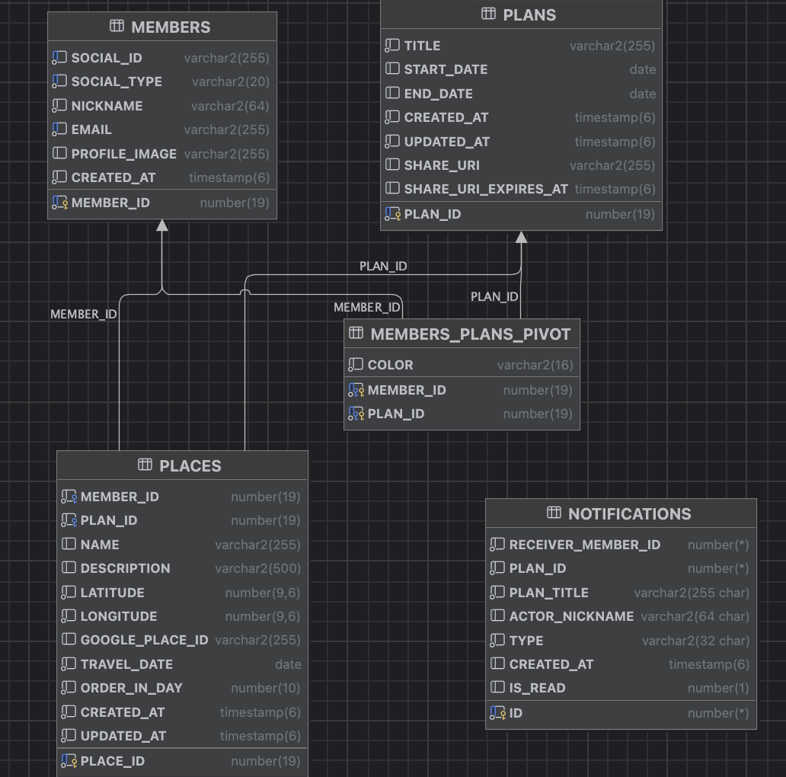

# michiki‑backend

## 概要
Michiki は旅行計画を複数人で共有しながら作成・管理するための Web アプリです。本リポジトリはそのバックエンドであり、Spring Boot を用いて REST API と WebSocket を提供します。ユーザーは Google OAuth でログインし、トークンベース認証（JWT）で各種機能を利用します。旅行計画（Plan）を作成し、日付や順序付きで訪問先（Place）を登録したり、メンバーを招待したり、計画を共有用 URL で公開したりできます。また、メンバーごとに色を割り当てて視覚的に区別し、リアルタイムに色の変更を反映させる WebSocket、他のメンバーへの通知機能も備えています。

## 主な機能

- **Google OAuth によるログイン**：メンバーは Google の認証コードを送信するだけでログインできます。バックエンドは Google のトークンサービスからアクセストークンを取得し、ユーザー情報を読み取って新規登録または既存アカウントの認証を行います。
- **JWT ベースの認証／認可**：ログイン後はアクセストークンとリフレッシュトークンを発行し、Spring Security と `JwtTokenFilter` により各 API を保護します。Swagger UI など一部のパスはフィルター対象外となります。
- **旅行計画の管理**：
  - 新規計画の作成。タイトル・開始日・終了日を指定し、計画ごとに一意な共有 URI が生成されます。
  - 指定した年に開始する計画の一覧取得（D‑day 計算付き）。
  - 計画詳細の取得。計画に属する全ての場所と参加メンバー（メンバー ID・ニックネーム・色）を返します。
  - 計画から退出／最後の参加者が退出した場合は計画を削除します。
  - 共有 URI から計画を閲覧し、ログイン済みの場合は自動的に参加します。
  - 参加メンバーは自分の色を変更できます。変更イベントは WebSocket で他メンバーへ通知されます。
- **場所の管理 (Place)**：
  - 計画内に訪問先を追加し、名称・緯度・経度・Google Place ID・訪問日・日内順序を保存します。
  - 場所の名称や説明の編集、削除、同じ日付内での順序並べ替えが可能です。
  - これらの操作は計画に参加しているユーザーのみが実行でき、変更後には「場所が変更された」という通知がリアルタイムに送出されます。
- **通知 (Notification)**：他のユーザーが計画に参加・退出・削除した際や場所が変更された際に、各メンバーの専用チャンネルへ通知を送ります。通知エンティティは受信者 ID、計画 ID、アクションを行ったメンバーのニックネーム、通知種別などを保持します。
- **RESTful API と WebSocket**：`/plans`、`/plans/{planId}/places` 等の REST API のほか、`/topic/plan/{planId}/color` や `/sub/plans/{planId}/place-changed` などの WebSocket チャンネルを用意しています。クライアントは STOMP over WebSocket を使用してリアルタイムイベントを購読します。

## 技術スタック

- **言語／ランタイム**：Java 21 (build.gradle で指定)
- **フレームワーク**：Spring Boot 3.5.x、Spring Data JPA、Spring Security、Spring WebSocket
- **認証**：JSON Web Token (jjwt 0.11.5)、Google OAuth 2.0 (RestClient 使用)
- **DB**：Oracle Database（URL・資格情報は `application.yml` の環境変数で指定）
- **API ドキュメント**：springdoc-openapi による `/swagger-ui` および `/v3/api-docs`
- **その他**：Lombok によるボイラープレート削減、WebSocket/STOMP によるリアルタイム通信、AOP + MDC によるロギング機能

## ディレクトリ構成の概要

```
michiki-backend/
└─ michiki/src/main/java/com/michiki/michiki/
   ├─ common/       … 共通機能 (認証・設定・例外・ロギング等)
   │   ├─ auth/     … JWT 生成や Google 認証サービス
   │   ├─ config/   … Spring Security・CORS 設定など
   │   ├─ exception … カスタム例外と GlobalExceptionHandler
   │   └─ mdc/      … ログにトレース ID を付与する MDC フィルター
   ├─ member/       … ユーザー (Member) ドメイン
   │   ├─ entity/   … Member エンティティ
   │   ├─ controller/ … Google ログイン・ログアウト・退会 API
   │   ├─ service/  … MemberServiceとリフレッシュトークン管理
   ├─ plan/         … 計画 (Plan) ドメイン
   │   ├─ entity/   … Planおよび Notification
   │   ├─ dto/      … PlanRequestDto, PlanResponseDto, PlanDetailResponseDto 等
   │   ├─ service/  … PlanServiceや NotificationService
   │   ├─ controller/ … PlanController
   │   └─ socket/   … WebSocket 用メッセージハンドラー (色変更通知など)
   ├─ place/        … 訪問先 (Place) ドメイン
   │   ├─ entity/   … Place エンティティ (緯度・経度・訪問日など)
   │   ├─ dto/      … PlaceRequestDto, PlaceResponseDtoなど
   │   ├─ service/  … PlaceService(追加・編集・削除・順序変更)
   │   └─ controller/ … PlaceController
   └─ pivot/entity … Member と Plan の多対多関係を扱う MemberPlan

```

## セットアップ手順

1. **環境の準備**
   - JDK 21 以上および Gradle が必要です。Java と Gradle をインストールしてください。
   - Oracle Database を用意し、`application.yml` に記載された JDBC URL でアクセスできるようにします。代わりに H2 など他の DB を使う場合は `driver-class-name` や `dialect` を変更します。
2. **リポジトリの取得**
   ```bash
   git clone https://github.com/TeamCodeGears/michiki-backend.git
   cd michiki-backend/michiki
   ```
3. **環境変数の設定**
   `michiki/src/main/resources/application.yml` では機密情報を外部変数として参照しています。以下をシェル環境に export するか、`gradle.properties` 等に定義してください。
   - **ORACLE_RDS_USERNAME / ORACLE_RDS_PASSWORD** – Oracle DB のユーザー名とパスワード。
   - **JWT_SECRET** – 32 文字以上の base64 エンコード文字列。アクセストークンとリフレッシュトークンを検証する鍵です。
   - **GOOGLE_CLIENT_ID / GOOGLE_CLIENT_SECRET** – Google OAuth 用のクライアント情報。
   - 必要に応じて `oauth.google.redirect-uri` を自分のフロントエンド URL に合わせて変更します。
4. **ビルドと実行**
   - 依存関係を取得し、アプリケーションを起動します。
   ```bash
   # *nix/MacOS
   ./gradlew bootRun
   ```
   Windows では `gradlew.bat bootRun` を使用してください。
5. **API ドキュメントの確認**
   起動後、`http://localhost:8080/swagger-ui/index.html` にアクセスすると、自動生成された Swagger UI から API を試すことができます。

## API エンドポイント概要

| 分類 | メソッド & パス | 説明 |
|------|----------------|------|
| 認証 | `POST /member/google/login` | `RedirectDto` に含まれる Google 認証コードを受け取り、アクセストークン・リフレッシュトークンを発行します。 |
| 認証 | `POST /member/logout` | Authorization ヘッダーの Bearer トークンを削除し、リフレッシュトークンを失効させます。 |
| 認証 | `POST /member/withdraw` | 現在ログイン中のユーザーを退会させ、関連データを削除します。 |
| 計画 | `GET /plans?year=YYYY` | 指定した年に開始する計画一覧を取得します。 |
| 計画 | `POST /plans` | `PlanRequestDto`（タイトル・開始日・終了日）を送信して新しい計画を作成します。 |
| 計画 | `POST /plans/{planId}` | 現在の計画から退出します。最後の参加者が退出した場合は計画も削除されます。 |
| 計画 | `GET /plans/{planId}` | 指定した計画の詳細を取得します。 |
| 計画 | `GET /plans/share/{shareURI}` | 共有 URI から計画を読み取り、ログイン状態によって観覧または参加処理を行います。 |
| 場所 | `POST /plans/{planId}/places` | 計画に新しい場所を追加します。 |
| 場所 | `PUT /plans/{planId}/places/{placeId}` | 場所の名前・説明を更新します。 |
| 場所 | `DELETE /plans/{planId}/places/{placeId}` | 指定した場所を削除します。 |
| 場所 | `PUT /plans/{planId}/places/reorder` | 同じ日付内の複数の場所の並び順を変更し、更新後のリストを返します。 |
| 通知 | `POST /plans/notifications/read` | すべての通知を既読にします。 |

※ 各エンドポイントは JWT を用いた認証が必要ですが、`/member/google/login`・`/swagger-ui` 等は認証不要です。

## WebSocket チャンネル

Michiki はリアルタイムの更新を実現するために STOMP over WebSocket を採用しています。デフォルトのエンドポイントは `/ws` で、以下のチャンネルが使用されています。

- `@MessageMapping("/colorChange")` – メンバーの色変更リクエストを受け付けます。サーバーは `/topic/plan/{planId}/color` に配信し、クライアントはこのトピックを購読して UI に色を反映します。
- 通知は `/sub/member/{memberId}/notifications` チャンネルに送信されます。クライアントはこのチャンネルを購読することで他のメンバーの行動に関する通知を受け取れます。
- 場所の追加・編集・削除・並べ替え操作後には `/sub/plans/{planId}/place-changed` へ簡易メッセージが送信されます。クライアントはこのイベントを受けて計画の詳細を再取得します。

## 開発に関する注意点

- `application.yml` では `ddl-auto: validate` としているため、事前に Oracle DB にテーブルを作成する必要があります。テーブル名やシーケンス名はエンティティのアノテーションに記載されています（例：Plan は `PLANS` テーブルで `PLANS_SEQ` を使用）。
- リフレッシュトークンはデモ用にインメモリで保存しており、実運用では Redis など外部ストアに保存することを推奨します。
- WebSocket の接続 URL や許可するオリジンは `SecurityConfig` の CORS 設定に列挙されています。本番環境のドメインに合わせて調整してください。
- Lombok を使用しているため、IDE で Lombok プラグインを有効にする必要があります。

## ライセンス

本プロジェクトのライセンスファイルは含まれていません。使用や改変についてはチーム Code Gears に確認してください。

## ERD

